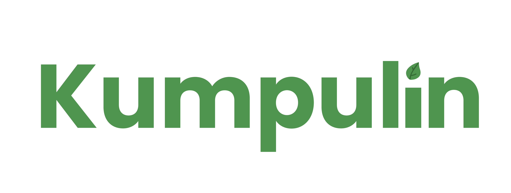

> If you find any bug or have any suggestion please create an Issue.

## about
Website tentang pengelolaan sampah daur ulang secara digital atau disebut bank sampah untuk kepentingan tugas

## feature
- Products Management & Barcode 
- Stock Management
- User Purchase Management
- Sale & expense Management
- Purchase & Sale Return Management
- Customer & Supplier Management
- User & Admin Management (Roles & Permissions)
- Product Multiple Images
- System Settings
- Currency settings
- All Reports (include profit report, payment report, sales report, purchase report, and sales return & purchase return report)

**purchase preview**

**post purchase preview**

**after purchase preview**

## local installation
- run ``composer install `` 
- run `` npm install ``
- run ``npm run dev``
- copy .env.example to .env
- run `` php artisan key:generate ``
- set up your database in the .env
- run `` php artisan migrate --seed ``
- run `` php artisan storage:link ``
- run `` php artisan serve ``
- then visit `` http://localhost:8000 or http://127.0.0.1:8000 ``.

## admin credential
email : admin@test.com
password : 12345678

## tech
- Laravel 8 - PHP Framework for building the admin dashboard and mobile api.
- Bootstrap 5.3.0
  
# license
[Creative Commons Attribution 4.0	cc-by-4.0](https://creativecommons.org/licenses/by/4.0/)
